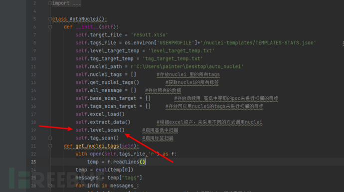
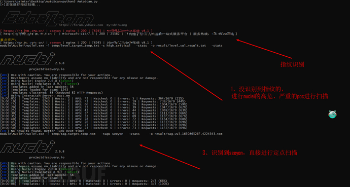

## 一、当前扫描器发现漏洞的痛点

- 1、扫描动静大，加载的无用的poc太多，耗费的时间长
- 2、即使有的扫描器支持指定插件扫描，需要人工参与的操作也太多，需要去资产里筛选资产，打个比方，需要对shiro定点检测漏洞，首先需要手工去我们指纹识别的资产里筛选出shiro，然后将筛选出来的目标丢到扫描器里进行定点扫描，如果只有一个 指纹还好，如果有多个类型的指纹，比如tomcat、thinkphp...等更多的指纹，如果都手工操作，无疑是浪费时间

## 二、本工具的特点

##### 指纹发现工具：EHole3.0

    感谢大佬们的工具，该工具我很喜欢，是一款针对重点资产指纹识别的工具，所以我的扫描器就是基于该工具来识别指纹
    
    选该工具之前，我尝试过whatweb-plus 加强版的指纹识别工具，该指纹识别工具指纹内置8000多条，但是在使用过后，我还是放弃了，因为他的指纹多导致扫描时间长，而且很多指纹漏洞意义不大，所以最终放弃。,同时希望大家明白，指纹并不是越多越好，有的指纹识别出来了，但是它对应的资产少、对应的漏洞比较鸡肋的话，那么这种指纹也就没必要了，所以采用了EHole的指纹

##### 构造指纹到漏扫的枢纽

通过代码自动监测指纹识别进程，一旦发现指纹识别完毕，则自动开启资产分类，没识别出任何指纹的资产将其放在A里，对于识别出指纹的资产进行分类，同一指纹的全部放到一起。然后调用nuclei扫描器进行自动扫描。

        有2种模式，可自行选择。一种是对所有的资产都进行扫描，工具内置的策略是对没有识别出指纹的资产使用nuclei里的高危、严重的poc进行监测，对于识别出指纹的资产，首先判定nuclei中是否有该指纹，如果没有，则将其丢到高危、严重的那种扫描模式里去扫描，如果nuclei中存在该指纹，则对该指纹下的所哟目标进行扫描

## 三、该扫描器的应用场景与应用技巧

    应用场景：
        一般用于快速、大批量发现漏洞，比如edusrc、公益src
    
    应用技巧：
        1、当我们对目标进行端口扫描，可将存在web服务的资产丢到该扫描器中
        2、当我们对目标进行子域名扫描，得到大量的子域名后，可将这些子域名统一丢到该扫描器中

## 四、扫描器实现思路

##### 启动EHole3.0

使用os.system执行以下命令输入xlsx

     EHole3.0.exe finger -l targets.txt -o wait_check.xlsx

##### 使用进程监控模块

    ProcessMonitor.py，监控上一步的指纹识别工具是否执行完毕，如果执行完毕才向下执行，否则就等待

```
#进程监控
import psutil
import subprocess
import platform,time
class ProcessMonitor():
    def __init__(self,processname):
        self.processname = processname
    def main(self):
        status = self.check_system()
        return status
    def check_system(self):
        plat = platform.system().lower()
        if plat == 'windows':
            return  self.win_process()
        elif plat == 'linux':
            return self.linux_process()

    def win_process(self):
        # print("[+]这是windows系统")
        while True:
            start_pl = psutil.pids()
            time.sleep(1)
            for pid in start_pl:
                if self.processname not in psutil.Process(pid).name():   #看我们监控的进程名是否在进程列表里
                    # print("[+]程序执行完毕")
                    return 1   #进程执行完毕


    # linux进程监控
    def linux_process(self):
        # print("[+]这是linux系统")
        while True:
            cmd = "ps -aux | grep {} ".format(self.processname)+"| grep -v grep | awk '{print $2}'"
            start_rsp = subprocess.Popen(cmd, stdout=subprocess.PIPE, stderr=subprocess.PIPE, shell=True)
            time.sleep(1)
            end_rsp = subprocess.Popen(cmd, stdout=subprocess.PIPE, stderr=subprocess.PIPE, shell=True)
            if len(start_rsp.stdout.read().strip()) != 0:
                # print("[+]程序正在执行中...")
                if len(end_rsp.stdout.read().strip()) == 0:
                    # print("[+]程序执行完毕")
                    return 1

```

##### 使用函数对资产进行分类

对未识别出的指纹直接统一丢到高危、严重扫描里
对于识别出指纹的，还需要将其与nuclei自带的标签进行比对，如果nuclei的标签在资产里存在，则将其归纳到使用标签扫描的资产里

```
    def extract_data(self):
        # print(self.all_message)
        temp_result = []
        for message in self.all_message:
            url = {}
            stat = 0  # 开关

            if message[1] == '':
                self.base_scan_target.append(message[0])    #该目标后续用高低中poc来进行批量扫描
            else :
                for t in self.nuclei_tags:
                    if str(t).lower() in str(message[1]).lower():
                        stat =1
                        url[t] = message[0]
                if stat == 0:     #一个目标，一个标签都没命中，就让其进行 高低中 扫描
                    self.base_scan_target.append(message[0])  # 该目标后续用高低中poc来进行批量扫描
            temp_result.append(url)
        result = {}

        for temp in temp_result:
            for tag in temp.keys():
                if result.get(tag) == None:
                    result.update({tag:[]})
                for t in temp.values():

                    result.get(tag).append(t)
        self.tags_scan_target = result
```


##### 根据上一步分类得到的资产，进行扫描

默认在代码里启用了针对未识别到指纹的资产进行高危、严重扫描，如果想更快速，可直接禁用掉该行，直接使用标签扫描即可


在使用nuclei扫描的时候，统一使用从本地文件加载目标，也就是扫描器执行过程中，会在temp目录下自动生成针对高低中危扫描的目标文件和基于不同标签的目标文件(文件名里包含temp的文件就是临时文件)，这里可以不用管他，全自动的，一旦存在漏洞，将会在result目录下创建level_vul_result.txt 和 tag_vul_result.txt，level_vul是基于高危、严重的扫描结果，tag_vul开头的是基于标签的扫描结果

##### 漏洞复现

根上一步扫出来的漏洞进行复现，看是否确实存在

## 五、扫描器使用教程

1、在扫描器所在目录放入targets.txt   ，该文件存放的是你准备指纹识别的目标
        支持输入的目标如下：两种不能混放
            192.168.1.1:9090 

​           http://192.168.1.1:9090

2、修改基本配置：打开AutoScan.py

- 修改你本地的nuclei的nuclei-templates/  目录下的json文件，可以用everying搜索下该文件，需要你提前运行下nuclei，才会自动下载该文件
- 默认关闭了self.level_scan()      高危、严重扫描，若要启用，请自行在第25行将注释去掉，不推荐启用，该模式会对那些没有识别到指纹的资产加载nuclei的所有的高危、严重的poc进行扫描，开启该模式会会导致整个扫描时间过长

3、执行命令安装依赖：pip3 install -r requirements.txt

4、执行命令开始运行：python3 AutoScan.py



## 六、后续待办

1、组合xray漏洞扫描器进行定点扫描
2、组合oneforall进行子域名扫描
3、组合masscan+nmap 端口扫描，将web服务进行保留
ps:大家有什么好的大范围端口扫描工具或者漏洞扫描工具都可以告诉我，我可以帮忙组合进去
## 七、完整项目地址和鸣谢

该扫描器下载地址：[lishang520/AutoScan: AutoScan:一款基于重点资产的自动识别+漏洞检测的工具 (github.com)](https://github.com/lishang520/AutoScan)

感谢EHole3.0、nuclei等出色工具的帮助

同时进程监控思路借鉴于：https://github.com/Echocipher/AUTO-EARN
